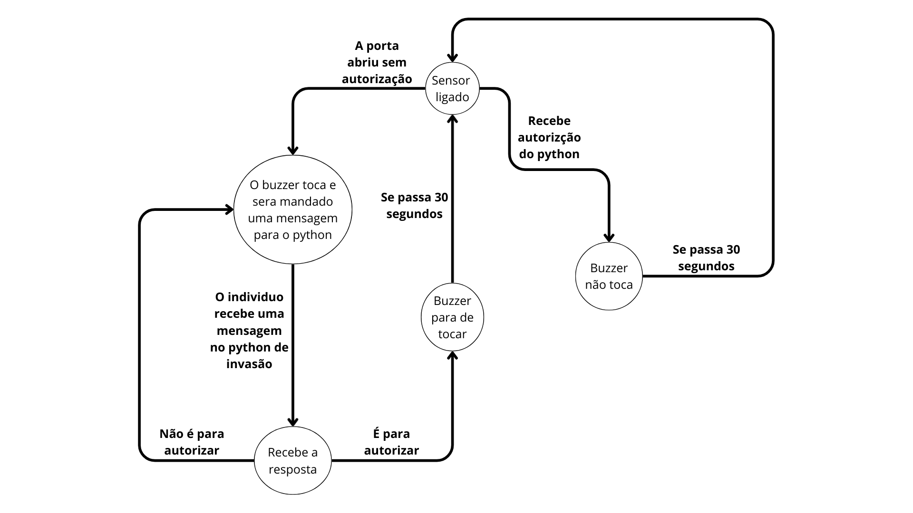

# 🔐 Sistema de Controle de Acesso  
### Integrando Python, Arduino e Banco de Dados SQLite

Este projeto foi desenvolvido como solução para controle de acesso automatizado, combinando interface gráfica em Python, comunicação com Arduino e registro de usuários e administradores em banco de dados SQLite.  
O objetivo principal é aumentar a segurança de ambientes físicos, permitindo controle rígido de entrada, detecção de violações e registro de acessos.

---

## 🚀 Tecnologias Utilizadas

- **Python 3**
  - Tkinter (interface gráfica)
  - SQLite3 (banco de dados local)
  - Threading (leitura assíncrona)
  - PySerial (comunicação Arduino)
- **Arduino UNO R3**
  - Comunicação Serial
  - Sensor TCRT5000 (detecção de abertura)
  - Buzzer (alarme sonoro)
- **Git / GitHub**

---

## 📌 Funcionalidades Principais

### 👤 Usuário
- Inserção de código de acesso
- Recebimento de autorização automática
- Abertura de porta mediante validação

### 👑 Administrador
- Login com nome e senha
- Criar usuários
- Criar novos administradores
- Ativar/Desativar sistema
- Parar alarme em caso de violação
- Rearmar sistema

### 🛡️ Segurança
- Alarme acionado ao detectar porta aberta sem permissão
- Sistema trava quando violado, só admin libera
- Rearme automático após porta ser fechada corretamente

---

## 🗄️ Estrutura do Projeto

📁 Projeto
│
├── main.py # Inicializa banco e abre interface
├── gui.py # Interface Tkinter e lógica principal
├── auth.py # Validação de usuários e admins
├── database.py # Banco SQLite, criação de tabelas e inserções
├── arduino_comm.py # Comunicação serial com o Arduino
│
└── logs.db # Banco de dados (gerado automaticamente)

---

## 🔷 Grafo do Projeto

  

---

## 🧠 Resumo dos Arquivos

### **main.py**
- Inicia o banco de dados
- Abre a interface principal do sistema

### **gui.py**
- Contém TODA a interface Tkinter
- Gerencia telas, botões, entradas
- Executa ações do admin e usuário
- Recebe mensagens do Arduino (callback)

### **database.py**
- Criação automática das tabelas (`users` e `admin`)
- Geração de códigos aleatórios
- Manipulação de dados no SQLite

### **auth.py**
- Validação de logins
- Criar usuários e admins

### **arduino_comm.py**
- Envia comandos ao Arduino (armar, desarmar, autorizar etc.)
- Recebe mensagens do Arduino em tempo real
- Suporte a modo simulação quando Arduino não está conectado
